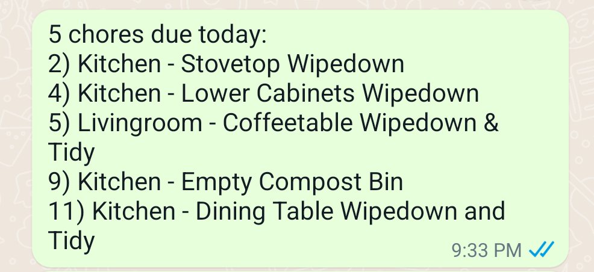

# grocy-notifier

Get periodic chore updates in a whatsapp group. Takes cron syntax and only sends notifications if chores are due.

## Usage

 > Create api key in grocy web ui
 > Set grocy url, ex: https://grocy.example.com/
```
GROCY_API_KEY=
GROCY_URL=
```
> Run `npx @open-wa/wa-automate`, scan qr code from terminal, navigate to `http://localhost:8002/` and use `/getAllGroups` or `/getAllChats` in the api explorer to find your chat ID. Hint: Be sure to clear the default query in the request body that filters to only conversations with new messages
```
WA_GROUP_ID=
```
> Optionally set desired chore notification schedule
```
CRON_CHORE_SCHEDULE=0 30 9 * * *
```
> Run `npm start` and authenticate in terminal



## Potential additions

* Chat commands (!claim, !done, !skip)
